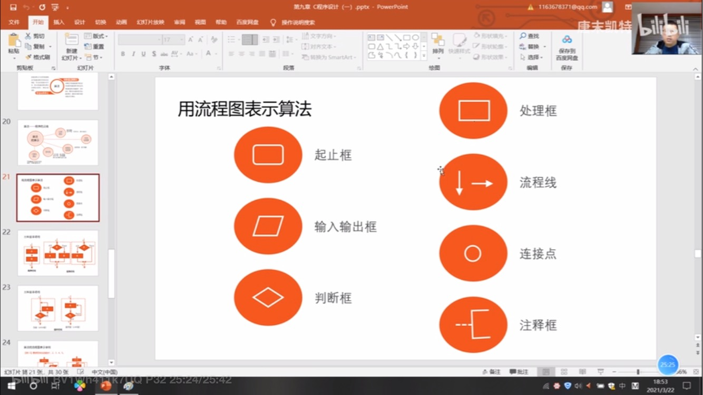
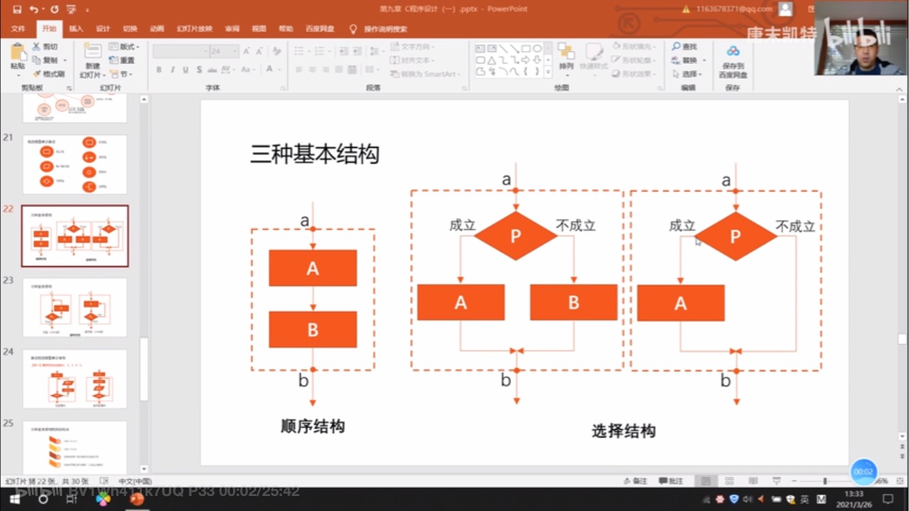
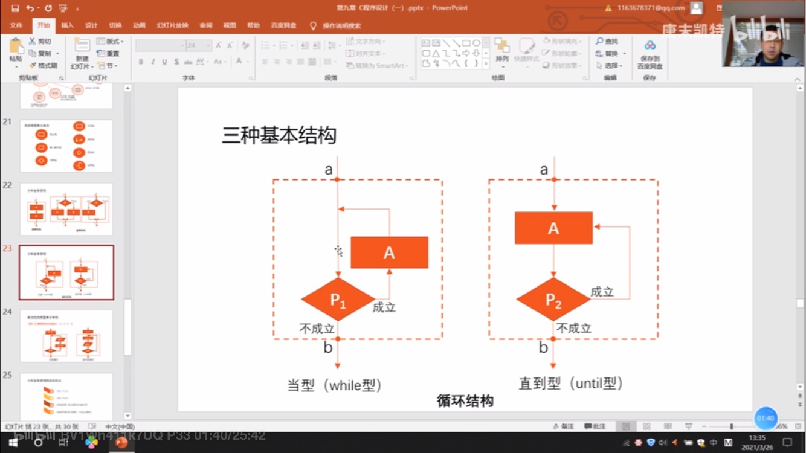

# 语法小记

## 初识

```c
#include <stdio.h> //预编译处理指令
/*
多行注释
*/
int main()
{
    printf("世界，你好"); //单条语句用;结尾
    return 0;
}
```

## 变量

变量声明 : `类型 变量名;`

占位符:%d是指用十进制形式输出

```c
#include <stdio.h>
int main()
{
    int a,b,c,sum;
    a=2;
    b=3;
    c=4;
    sum=a+b+c;
    printf("sum is %d\n",sum);
    return 0;
}
```

## 条件判断

```
#include <stdio.h>

int main(){
    //对被调用的函数max进行声明,如果函数定义在主函数之前，则不需要进行声明。因为编译是从上到下进行的
    int max(int age_1,int age_2);
    int age_1,age_2,age_max;
    //传入的变量的地址
    scanf("%d,%d",&age_1,&age_2);
    //调用函数
    age_max=max(age_1,age_2);
    printf("max age is %d\n",age_max);
    return 0;

}

//形式参数，是值传递
int max(int x,int y){
    int z;
    //if判断
    if(x>y){
        z=x;
    }
    else{
        z=y;
    }
    return z;
}
```





